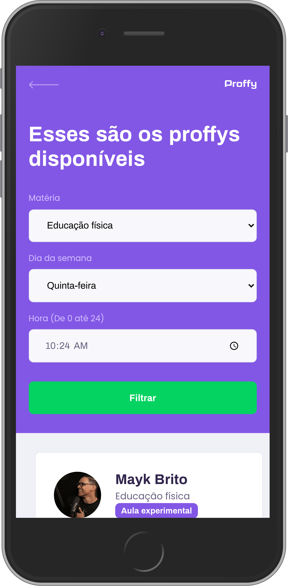
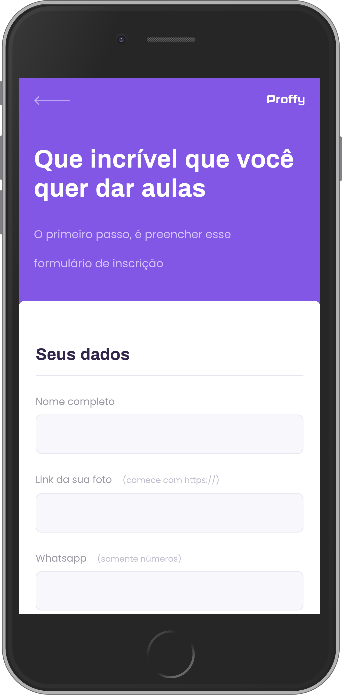

<!-- <h1 align="center">
    Proffy
</h1> -->
<h1 align="center">
   
</h1>

---

## 📖️ Sobre

O **Proffy** é uma plataforma de estudos online que conecta alunos e professores! Esta aplicação foi desenvolvida dentro da **Next Level Week** da RocketSeat.

---
### 💻️ Web 

   
   

---

### 📱️ Responsividade

   
   
   
   

---
Como usar
---

## 🚀️ Tecnologias utilizadas

O projeto foi desenvolvido utilizando as seguintes tecnologias.

- HTML5
- CSS3
- JavaScript
- NodeJs
- Expres
- Nunjucks
- SQLite

---

### Autor
---

 

 <b>Vinicius Hein</b>

Desenvolvido por Vinicius Hein 👋🏽 Entre em contato!

  
---
